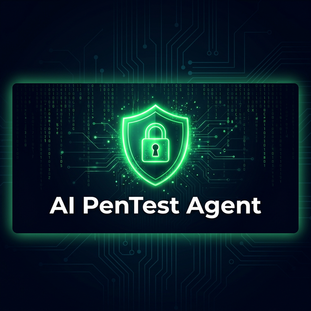
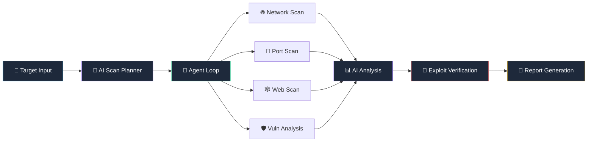

<p align="center">
  
</p>

<h1 align="center">🛡️ AI Penetration Testing Assistant</h1>

<p align="center">
  <b>An autonomous, AI-powered penetration testing agent for controlled & educational environments</b>
</p>

<p align="center">
  
  
  
  
  
</p>

<p align="center">
  <a href="#-features">Features</a> •
  <a href="#-architecture">Architecture</a> •
  <a href="#-quick-start">Quick Start</a> •
  <a href="#-scanner-modules">Modules</a> •
  <a href="#-api-reference">API</a> •
  <a href="#-disclaimer">Disclaimer</a>
</p>

---

## 🎯 Overview

**AI PenTest Agent** is a full-stack autonomous penetration testing assistant that combines traditional security scanning techniques with **Groq LLM-powered AI analysis**. It features an intelligent agent loop that autonomously plans, executes, and reports on security assessments — all through a sleek real-time web dashboard.

> ⚠️ **This tool is designed exclusively for authorized security testing in controlled/educational environments. Unauthorized use against systems you don't own or have permission to test is illegal.**

---

## ✨ Features

<table>
<tr>
<td width="50%">

### 🤖 AI-Powered Intelligence
- **Smart Scan Planning** — AI generates optimal scan strategies
- **Result Analysis** — LLM-driven vulnerability assessment
- **Remediation Advice** — Context-aware fix suggestions
- **Executive Summaries** — Auto-generated professional reports

</td>
<td width="50%">

### 🔍 Comprehensive Scanning
- **Network Discovery** — Host detection & OS fingerprinting
- **Port Scanning** — Multi-threaded TCP scanning (top 1000+)
- **Web Analysis** — Headers, tech stack, directories, SSL/TLS
- **Vulnerability Detection** — XSS, SQLi, misconfigurations

</td>
</tr>
<tr>
<td width="50%">

### 🧪 Exploit Verification Lab
- **Proof-of-Concept Testing** — Validate vulnerabilities
- **XSS Exploitation** — Reflected XSS payload injection
- **SQL Injection** — Error-based & data extraction tests
- **Visual Confirmation** — "You Have Been Hacked" PoC pages

</td>
<td width="50%">

### 📊 Real-Time Dashboard
- **Live SSE Streaming** — Watch scans execute in real-time
- **Severity Breakdown** — Critical/High/Medium/Low charts
- **Scan History** — Complete audit trail with timestamps
- **HTML & JSON Reports** — Export-ready documentation

</td>
</tr>
</table>

---

## 🏗️ Architecture

```
AIPhissingAgent/
│
├── 🐍 backend/                    # Flask REST API + AI Engine
│   ├── app.py                     # Flask app — routes, SSE, API endpoints
│   ├── agent_loop.py              # Autonomous scan orchestrator
│   ├── ai_engine.py               # Groq LLM integration
│   ├── config.py                  # Configuration & scan profiles
│   ├── database.py                # SQLite database layer
│   ├── reporter.py                # HTML & JSON report generator
│   ├── requirements.txt           # Python dependencies
│   └── scanner/                   # Scanner modules
│       ├── network_scanner.py     # Host discovery & OS fingerprinting
│       ├── port_scanner.py        # Multi-threaded TCP port scanning
│       ├── web_scanner.py         # HTTP security analysis
│       ├── vuln_analyzer.py       # Vulnerability classification
│       └── exploit_verifier.py    # PoC exploit verification
│
├── 🌐 frontend/                   # Single-Page Application
│   ├── index.html                 # Main SPA shell
│   ├── css/
│   │   └── styles.css             # Glassmorphism dark theme
│   └── js/
│       ├── app.js                 # SPA router, API client, SSE
│       ├── dashboard.js           # Dashboard charts & stats
│       ├── scanner.js             # Scan configuration UI
│       ├── exploits.js            # Exploit Lab interface
│       └── reports.js             # Report viewer
│
├── 📦 data/                       # Runtime data (git-ignored)
│   └── pentest.db                 # SQLite database
│
├── run.py                         # 🚀 Application entry point
├── .gitignore                     # Credential & cache exclusions
└── README.md                      # You are here
```

---

## 🔄 How It Works



| Phase | Module | Description |
|:------|:-------|:------------|
| **1. Planning** | `ai_engine.py` | AI generates an intelligent scan strategy based on target |
| **2. Discovery** | `network_scanner.py` | Resolves DNS, pings host, detects OS via TTL analysis |
| **3. Enumeration** | `port_scanner.py` | Multi-threaded TCP scan with service detection |
| **4. Analysis** | `web_scanner.py` | Security headers, directories, XSS/SQLi, SSL checks |
| **5. Classification** | `vuln_analyzer.py` | Assigns severity, CVSS scores, CVE references |
| **6. Verification** | `exploit_verifier.py` | Attempts PoC exploits to confirm vulnerabilities |
| **7. Reporting** | `reporter.py` | Generates executive summaries with AI insights |

---

## 🚀 Quick Start

### Prerequisites

- **Python 3.10+**
- **pip** (Python package manager)
- **Groq API Key** *(free at [console.groq.com](https://console.groq.com))* — optional, AI features work without it

### Installation

```bash
# 1. Clone the repository
git clone https://github.com/BHABANISHANKAR-01/AIPhissingAgent.git
cd AIPhissingAgent

# 2. Create virtual environment (recommended)
python -m venv venv
source venv/bin/activate        # Linux/Mac
venv\Scripts\activate           # Windows

# 3. Install dependencies
pip install -r backend/requirements.txt

# 4. (Optional) Set your Groq API key
export GROQ_API_KEY="your-api-key-here"        # Linux/Mac
set GROQ_API_KEY=your-api-key-here              # Windows CMD
$env:GROQ_API_KEY="your-api-key-here"           # PowerShell

# 5. Launch the application
python run.py
```

### Access

| Service | URL |
|:--------|:----|
| 🖥️ Dashboard | `http://localhost:5000` |
| 🔌 Health Check | `http://localhost:5000/api/health` |

> 💡 **Tip:** You can also configure the API key directly from the **Settings** page in the web dashboard.

---

## 🔍 Scanner Modules

### 🌐 Network Scanner
Performs host discovery with ICMP ping, DNS resolution (forward & reverse), OS fingerprinting via TTL analysis, and optional subnet scanning for live host enumeration.

### 🔌 Port Scanner
Multi-threaded TCP port scanning with configurable port ranges. Includes service detection for 25+ common protocols (SSH, HTTP, MySQL, RDP, etc.) and banner grabbing.

### 🕸️ Web Scanner
Comprehensive web application analysis:
- **Security Headers** — CSP, HSTS, X-Frame-Options, X-XSS-Protection, and more
- **Technology Detection** — Identifies frameworks (Django, Express, WordPress, etc.)
- **Directory Enumeration** — Checks 30+ sensitive paths (`.git`, `wp-admin`, `phpinfo`)
- **SSL/TLS Analysis** — Certificate validation, expiry, and protocol checks
- **XSS Testing** — Reflected XSS detection with safe payloads
- **SQLi Testing** — Error-based SQL injection indicator detection

### 🛡️ Vulnerability Analyzer
Aggregates findings from all scanners and classifies them with CVSS scores, severity levels, and CVE references where applicable.

### 🧪 Exploit Verifier
Attempts safe proof-of-concept exploitation to validate discovered vulnerabilities:
- Reflected XSS payload injection with visual confirmation
- SQL injection data extraction attempts
- Security header bypass demonstrations
- Sensitive file access verification
- Open service connection tests

---

## 📡 API Reference

| Method | Endpoint | Description |
|:-------|:---------|:------------|
| `GET` | `/api/dashboard` | Dashboard statistics |
| `GET` | `/api/scans` | List all scans |
| `POST` | `/api/scans` | Create a new scan |
| `GET` | `/api/scans/<id>` | Get scan details |
| `DELETE` | `/api/scans/<id>` | Delete a scan |
| `POST` | `/api/scans/<id>/stop` | Stop a running scan |
| `GET` | `/api/scans/<id>/logs` | SSE real-time log stream |
| `GET` | `/api/findings` | All findings |
| `GET` | `/api/scans/<id>/findings` | Findings for a scan |
| `GET` | `/api/scans/<id>/report` | Generate report |
| `POST` | `/api/exploit/verify` | Verify a single finding |
| `POST` | `/api/exploit/verify-all/<id>` | Verify all findings |
| `GET` | `/api/settings` | Get current settings |
| `PUT` | `/api/settings` | Update settings |
| `GET` | `/api/health` | Health check |

---

## ⚙️ Scan Profiles

| Profile | Ports | Modules | Timeout |
|:--------|:------|:--------|:--------|
| **🟢 Quick** | Top 100 + common | Port scan | 2s |
| **🟡 Standard** | Top 1000 | Port + Web + Vuln | 3s |
| **🔴 Deep** | All 65,535 | Network + Port + Web + Vuln | 5s |

---

## 🔒 Security & Credentials

This project follows security best practices to ensure **no credentials are exposed**:

- ✅ API keys loaded from **environment variables** (`GROQ_API_KEY`)
- ✅ API keys can be configured via the **web dashboard** (stored in local SQLite DB)
- ✅ API keys are **masked** in API responses (`gsk_abc1...xyz9`)
- ✅ Database files are **git-ignored** (`.gitignore`)
- ✅ No secrets hardcoded in source code

---

## 🛠️ Tech Stack

<p align="center">
  
  
  
  
  
  
  
</p>

---

## ⚠️ Disclaimer

> **This tool is intended strictly for educational purposes and authorized security testing.**
>
> - Only use this tool against systems you **own** or have **explicit written permission** to test.
> - Unauthorized access to computer systems is **illegal** under laws such as the CFAA, CMA, and IT Act.
> - The developers assume **no liability** for misuse of this tool.
> - Always follow **responsible disclosure** practices when reporting vulnerabilities.

---

## 👤 Author

**BHABANI SHANKAR**

<p>
  <a href="https://github.com/BHABANISHANKAR-01">
    
  </a>
</p>

---

<p align="center">
  <i>Built with 🐍 Python & 🤖 AI for cybersecurity education</i>
</p>
